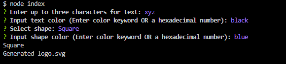
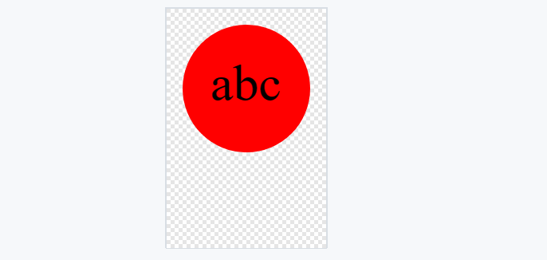

# SVG LOGO GENERATOR

## What it does ?

This svg logo generator generates basic shapes such as circles, squares, and triangles. These can be used for various different purposes ranging from placeholder use to vector designs.

## How to use

1. `git clone` this repo & run a `npm i`

2. In the terminal when everything is installed, run `node index` to start up the generator (screenshot below)

3. Input your desired text and select your color and shape

4. It will then generate your logo as `"logo.svg"` in the root of this project's directory

## Generated Logo Screenshot

## Video Demo

## Credits

Sameer Mirza | Columbia Coding Bootcamp
